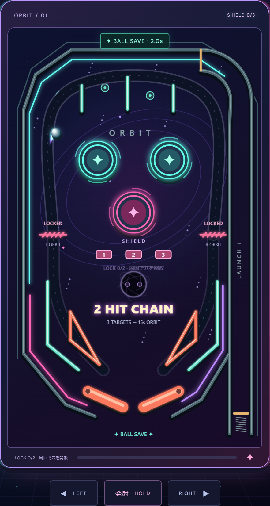

# ORBIT Pinball

TypeScript + Canvas 2D で作った、3球制のブラウザ用ピンボールです。

**▶ ブラウザですぐ遊べます: <https://neoenox.github.io/orbit-pinball/>**



## 起動

```sh
npm install
npm run dev
```

表示されたローカルURLをブラウザで開いてください。

## 操作

- ← / → または A / D: 左右フリッパー
- Spaceを長押しして離す: 発射（長押しで強くなる）
- P / Escape: 一時停止・再開
- スマホ: 台の下の左右・発射ボタン。複数の指で同時操作可能

バンパーは100点、スリングショットは10点。バンパー10ヒットごとに倍率が増え、最大5倍になります。残り1球になるとバンパーが2倍になります。振り上げ中のフリッパーで深い位置をギリギリ救済するとDANGERボーナス+50点(ラスト1球時は+100点、1.5秒に1回まで)。3球落とすとゲーム終了。最高得点はlocalStorageに保存します。タブ移動時は自動で一時停止します。

発射後5秒以内に落とした球は、各球につき1回だけ救済します。残り球数と得点を維持し、0.75秒後に同じ強さで自動再発射します。救済球に新しい救済時間は付きません。一時停止中は残り時間と再発射待ち時間も止まります。

発射球はカーブしたレールに沿って台へ入り、ためた強さが軌道に反映されます。フリッパーは加速して振り上がり、ゆっくり戻ります。接触位置・タイミングに応じた反発と打球音があり、バンパーの連続ヒットには点数表示と音程の変化が付きます（連続ヒット自体による追加倍率はありません）。

2.2秒以内のバンパーヒットをつなぐと、3 / 5 / 8 / 12 HITでそれぞれ+500 / +1,000 / +2,500 / +5,000点のコンボボーナスを獲得します。各閾値は同じチェーン内で1回だけ、倍率やラスト1球ボーナスとは別の固定点です。時間切れ・落球・ボール救済でチェーンが切れ、次のチェーンでは再獲得できます。

## ネオン演出

宇宙背景、シアンとピンクの筐体、光る球の軌跡、バンパーの火花と衝撃波、連続ヒット表示を追加しています。倍率アップとボール救済にも専用の演出があります。演出は得点ルール・球の軌道に影響しません。

コンボ・BALL LOCK・SUPERNOVA・JACKPOTには中央の大型表示とWebAudioの報酬音があります。スコアの加算量と次の倍率・ミッションへの距離を表示し、ゲート残り5秒は色と下線で強調します。ゲーム終了時は自己ベスト更新またはベストまでの差分を表示し、その場で再挑戦できます。

右上の「演出 MAX / LIGHT」で切り替えられます。LIGHTでは動く装飾・火花・軌跡・画面の揺れ・フラッシュ・スコア拡大を抑え、報酬の文字情報は維持します。端末で「視差効果を減らす」などの設定を有効にしている場合、初期表示はLIGHTです。MAXを選び直しても端末の動き抑制設定を優先します。演出と救済のタイマーは一時停止中に止まります。

## シールドゲートと周回ランプ

- 中央の「1・2・3」の的に当てると1枚ずつ倒れ、各100点。3枚すべて倒すと左右のゲートが15秒間開きます。
- 「POINTS / CHARGE ↑」の入口へ下から打ち込むと、高架ランプを周回します。左入口からは右フリッパーへ、右入口からは左フリッパーへ戻ります。
- 左ランプは同じ開放時間内の周回で500 → 1,000 → 1,500 → 2,000点と増加し、以後は2,000点。バンパー倍率とは別の固定ボーナスです。
- 右ランプは固定1,000点ですが、周回ごとにバンパー倍率が+5ヒット分チャージされます(2周で倍率UP相当)。倍率が低い序盤は右、倍率が上がったら左が効率的です。
- 時間切れでゲートが閉じ、3枚の的が復活します。すでに入口を通った球は周回を完了し、入場時に決まった点数を獲得します。
- 一時停止中はゲートの時間と周回中の球も停止します。ボール救済では的・ゲートの進捗を引き継ぎますが、通常の落球で次の球に進むとリセットされます。

ランプの表示と移動は共通の曲線を使い、周回中だけ通常盤面の障害物より上を通ります。ゲート閉鎖時は入口で球が反発します。

## ブラックホールと超新星マルチボール

- 通常のランプを1周すると、中央のブラックホールが開きます。穴へ球を入れると1球保管し、残り球数を消費せず自動で次の球を発射します。補充球には新しいボール救済は付きません。
- もう一度周回して穴を開き、2球目を保管すると「超新星モード」が始まり、3球が同時に飛び出します。球同士も衝突します。
- 超新星中は左右ゲートが常時開放され、全ボール共通の完走順で5,000 → 10,000 → 15,000 → 25,000点とジャックポットが育ちます。4周目以降は25,000点。複数球が同時に別々のランプを周回しても完走ごとに1段階進み、次の超新星では5,000点に戻ります。
- 追加球の落下では残り球数は減りません。盤上に1球だけ残ると通常モードへ戻り、その球で続けます。最後の球が落ちたときだけ残り球数を1つ減らします。全球が同時に落ちた場合も1つだけです。
- 超新星終了時、すでにランプに入っている球は最後まで走り、その超新星の育成段階に応じたジャックポットを獲得します。新しい周回には再び3枚の的を倒す必要があります。
- 保管済みの球は通常の落球後も引き継ぎます。開放中の穴は次の球では閉じます。「もう一度はじめる」で保管数もリセットします。
- 一時停止中は吸い込み・補充待ち・すべての球が止まります。演出LIGHTでも球数・穴の開放・ジャックポットの情報は表示されます。

## 検証・ビルド

```sh
npm test
npm run test:browser
npm run build
npm run preview
```

テストは Node.js 22.6以降が必要です。ブラウザテストはインストール済みの Microsoft Edge を使用します。物理演算は240Hzの固定ステップで、壁・バンパー・動くフリッパーとの衝突を計算します。ゲーム実行時に必要な外部ライブラリはありません。Google Fontsに接続できない場合はシステムフォントで動作します。
